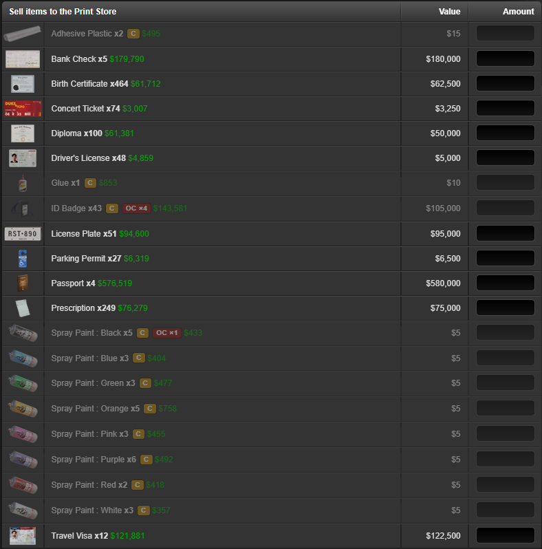

# TORN Crime Item Tagger

Tags your inventory so you can see at a glance which items are used for **Crimes 2.0** and which are
used for **Organized Crimes** — without cross-referencing the wiki every time.

### Don't sell what a crime needs

*Selling to an NPC shop with **Dim Crime & OC Items** on. Everything a crime or an organized crime
needs is greyed out and badged, so the rows you are safe to sell are the bright ones — no more
dumping a stack of Gasoline an hour before the OC needs it.*

### Organized Crime tooltip

*Every organized crime that needs the item, its difficulty, which positions want it, and whether you
get the item back.*

### Crimes tooltip

*What the item does in each crime — and for forgery materials, every project it can be used to make.*

## What you see

Badges sit on each item row, right after the quantity. The number is always *how many crimes use the
item*; the tooltip breaks down the positions inside each one.

They appear on your **Items** page and on the **sell list** of Torn's NPC shops, the bazaar and the
item market — the places where you are about to part with something. The shop *buy* grid is
deliberately left alone: the tiles have no room for a badge, and knowing an item is needed is what
matters when you are selling, not buying.

| Badge | Meaning |
|---|---|
| `C` / `C ×2` | Used in that many regular crimes |
| `OC ×3` | Used in that many organized crimes |
| `OC ×3 ✓` | The OC you are in needs it, and everyone has one |
| `OC ×3 ⚠` | The OC you are in needs it, and a teammate does not have it yet |

Hovering gives the detail: which crimes, which positions inside each, the crime's difficulty, whether
the item is consumed or returned, how many you hold, and how many the faction armoury has spare.

### If *you* are missing an item

A badge cannot tell you that — an item you do not own has no inventory row to put a badge on. So you
get a **red banner** naming the item, your position and the countdown, plus a red dot on the CIT tab.
You can hide the banner, but it returns on every page load until you have the item.

### If a *teammate* is missing an item

The tooltip names them. Clicking that name takes you to the faction armoury, scrolls to the item's
**Available** row, highlights it for eight seconds, and copies `TheirName [12345]` to your clipboard
so the member box is one paste away. The same links inside **OC Manager** behave identically.

**The script never clicks Loan and never fills the form.** It gets you to the right row with the
right text on the clipboard; every action that moves an item is yours.

## The panel

A **CIT** tab sits on the right edge of every Torn page. Every section collapses and remembers
whether you left it open.

- **Your current OC** — status, countdown, when the reading was taken, which positions are short,
  and whether the armoury can cover them.
- **Organized Crime item coverage** — every OC item in the game, split into **Missing** and **Held**,
  each sorted by how many positions want it. The top of the missing list unblocks the most crimes.
- **Crime item coverage** — the same per crime: Arson, Bootlegging, Burglary, Card Skimming,
  Cracking, Disposal, Forgery, Graffiti and the rest, each with a held/total count. Forgery also
  lists which of the 17 projects you can complete now and what is blocking the others.
- **OC Manager** *(optional, see below)* — every position across all your faction's organized crimes
  whose member is missing the required item.

## Settings

| Setting | What it does |
|---|---|
| Show `[C]` badges | Regular-crime badges on item rows |
| Show `[OC]` badges | Organized-crime badges on item rows |
| Dim Crime & OC Items in Torn NPC Shops page | In a shop, bazaar or the item market, fades the items a crime needs — what stays bright is safe to sell |
| **Live OC data (Torn API)** | Master switch for every API call — see below |
| **OC Manager** | Adds the faction-wide shortfall section to the panel |
| Dim non crime & non OC items in Items page | On your own Items page, fades everything no crime uses, so the useful rows stand out |

The two dimming switches are deliberately opposite, because the question is opposite. On your Items
page you want to find what a crime needs; in a shop you want to find what is safe to sell. Each one
only acts on the pages it names.

### Live OC data (Torn API)

This is the single switch for everything that talks to `api.torn.com`. It is on by default, and with
a key saved there is little reason to turn it off except to rule the API out while debugging.

**Still works with it off** — nothing here needs the network:

- `C` and `OC` badges from the built-in table of ~128 items, and all their tooltips
- Quantities, read from your own item pages
- Both dimming switches, on the Items page and in shops
- Crime item coverage and Forgery readiness
- Armoury stock and OC Manager, both read from the pages themselves
- The CIT tab and panel

**Stops working with it off:**

- Your live OC — status, countdown, who is short, the red banner and the tab's alert dot
- Teammate names, and the loan links that depend on them
- The authoritative OC definitions, so OC badges fall back to the built-in table and lose their
  counts (plain `OC` instead of `OC ×3`)
- The item catalogue, so badge matching drops from item-ID-based back to name matching

## API key — optional

The script works immediately with no key. A key adds live status for the organized crime you are in,
resolves teammate names, and pulls OC definitions from Torn so they stay correct when the game
changes. **No faction API access is required** — it reads your own OC through your own key.

Open the **CIT** tab, paste, save. A Limited Access key works, but a custom key scoped to these four
selections does the same job with far less exposure:

| Section | Selection | Used for |
|---|---|---|
| `torn` | `items` | Item names and IDs |
| `torn` | `organizedcrimes` | Every OC, its positions and required items |
| `user` | `organizedcrime` | The OC you are currently in |
| `user` | `basic` | Resolving teammate IDs to names |

## Privacy

Your key is stored locally by your userscript manager and is sent only to `api.torn.com` — the single
host declared in `@connect`. Nothing is sent to the author or any third party. No analytics, no
remote code, no external libraries.

## Torn's rules

The script is built to stay inside them:

- **No automation.** It never clicks, submits or actions anything — there is not a single
  `.click()` or synthetic event in the source. It renders information and copies text to your
  clipboard; you do the rest.
- **No page scraping.** It never fetches a torn.com page. It reads only the DOM of the page you
  loaded and are looking at, which is the same thing TornTools does.
- **Nothing runs in a hidden tab.** Page reading and API calls are suspended while the tab is not
  visible and resume when you return to it.
- **API calls only, and few of them.** The only host contacted is `api.torn.com`. Results are cached
  (item catalogue, OC definitions and names weekly; key info hourly; your OC for two minutes), so
  ordinary browsing costs close to nothing. Loading the items or faction page refreshes your OC
  status, because navigating there is a deliberate action by you.

## Notes

- Torn has retired the inventory API (`user/?selections=inventory` now replies *"The inventory
  selection is no longer available"*, and the v2 replacement demands Full access). Quantities are
  therefore read from your own item pages and fill in per category tab as you browse. Where the OC
  feed disagrees — it knows whether your position has its item — the API wins.
- The faction armoury and faction crimes are not reachable with a personal key either; those
  selections need faction API access and return error 7 without it. Both are read off their own
  pages when you visit them and cached with a timestamp, so figures are labelled "as of" rather
  than presented as live.
- Faction page classes are hashed by Torn's build, so the armoury and OC Manager readers match on
  class prefixes. A Torn UI rebuild is the most likely thing to break them.
- Shop rows sit their names lower than the Items page does, so shop badges get their own vertical
  nudge (`html.cit-sell .cit-badge`). If a Torn layout change leaves them misaligned, that single
  `top` value is the only thing to adjust.

## Found a bug?

Before reporting, click **Diagnostics** in the CIT panel, then open the browser console (F12) and
include the `[CIT]` lines — they pinpoint the problem straight away. Do not paste your API key.

## Licence

MIT
