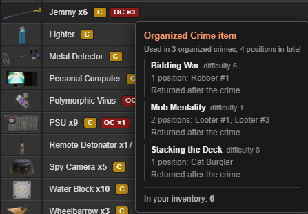
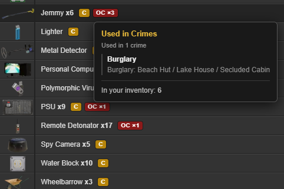

# TORN Crime Item Tagger

Tags your inventory so you can see at a glance which items are used for **Crimes 2.0** and which are
used for **Organized Crimes** — without cross-referencing the wiki every time.

### Organized Crime tooltip

*Every organized crime that needs the item, its difficulty, which positions want it, and whether you
get the item back.*

### Crimes tooltip

*What the item does in each crime — and for forgery materials, every project it can be used to make.*

## What you see

Badges sit on each item row, right after the quantity. The number is always *how many crimes use the
item*; the tooltip breaks down the positions inside each one.

| Badge | Meaning |
|---|---|
| `C` / `C ×2` | Used in that many regular crimes |
| `OC ×3` | Used in that many organized crimes |
| `OC ×3 ✓` | The OC you are in needs it, and everyone has one |
| `OC ×3 ⚠` | The OC you are in needs it, and a teammate does not have it yet |

Hovering a badge gives the detail: which crimes, which positions inside each, the crime's difficulty,
whether the item is consumed or returned, and how many you hold.

### If *you* are missing an item

A badge cannot tell you that — an item you do not own has no inventory row to put a badge on. So you
get a **red banner** naming the item, your position and the countdown, plus a red dot on the CIT tab.
You can hide the banner, but it returns on every page load until you have the item.

### If a *teammate* is missing an item

The tooltip names them and links them. Clicking that name takes you to the faction armoury, scrolls
to the item's **Available** row, highlights it, and copies `TheirName [12345]` to your clipboard so
the member box is one paste away.

**The script never clicks Loan and never fills the form.** It gets you to the right row with the
right text on the clipboard; every action that moves an item is yours.

## The panel

A **CIT** tab sits on the right edge of every Torn page. It opens:

- **Your current OC** — status, countdown, which positions are covered and which teammates are short.
- **Organized Crime item coverage** — every OC item in the game, held versus missing, sorted by how
  many positions want it. The top of that list unblocks the most crimes.
- **Crime item coverage** — the same idea per crime: Arson, Bootlegging, Burglary, Card Skimming,
  Cracking, Disposal, Forgery, Graffiti and the rest, each with a held/total count. Forgery also
  lists which of the 17 projects you can complete now and what is blocking the others.

Every section collapses, and remembers whether you left it open.

## Installation

1. Install [Tampermonkey](https://www.tampermonkey.net/) (or Violentmonkey).
2. Install the script from [Greasyfork](https://greasyfork.org/).
3. Open your items page. Done — it works with no further setup.

## API key — optional

The script works immediately with no key, using its built-in crime data.

A key adds live status for the organized crime you are in, resolves teammate names, and pulls OC
definitions from Torn directly so they stay correct when the game changes. **No faction API access is
required** — it reads your own OC through your own key.

Open the **CIT** tab, paste, save. A Limited Access key works, but a custom key scoped to these four
selections does the same job with far less exposure:

| Section | Selection | Used for |
|---|---|---|
| `torn` | `items` | Item names and IDs |
| `torn` | `organizedcrimes` | Every OC, its positions and required items |
| `user` | `organizedcrime` | The OC you are currently in |
| `user` | `basic` | Resolving teammate IDs to names |

## Privacy

Your key is stored locally by your userscript manager and is sent only to `api.torn.com` — the single
host declared in `@connect`. Nothing is sent to the author or any third party. No analytics, no
remote code, no external libraries.

## Notes

- Torn's inventory API returns nothing usable, so quantities are read from the item pages themselves.
  They fill in per category tab as you browse. Where the OC feed disagrees — it knows whether your
  position has its item — the API wins.
- Results are cached (item catalogue and OC definitions weekly, your OC every two minutes, names for
  a week), so normal browsing costs a handful of API calls against a limit of 100 per minute.
- Badges are injected only on item pages. The tab, panel and banner work everywhere on Torn.

## Found a bug?

Torn changes its page markup periodically, which is the most likely thing to break. Before reporting,
click **Diagnostics** in the CIT panel, then open the browser console (F12) and include the `[CIT]`
lines — they pinpoint the problem straight away. Do not paste your API key.

## Licence

MIT
